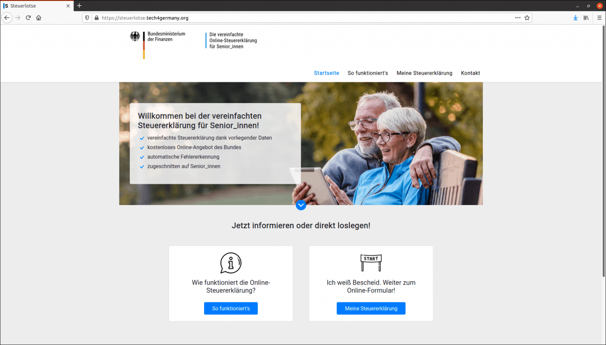
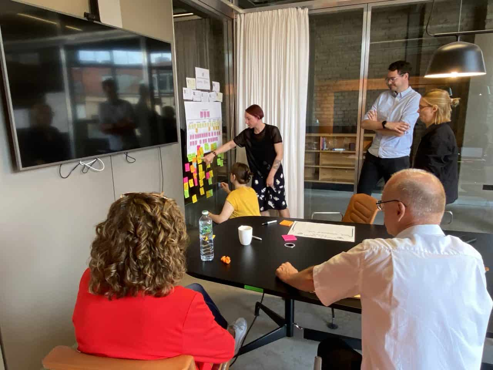
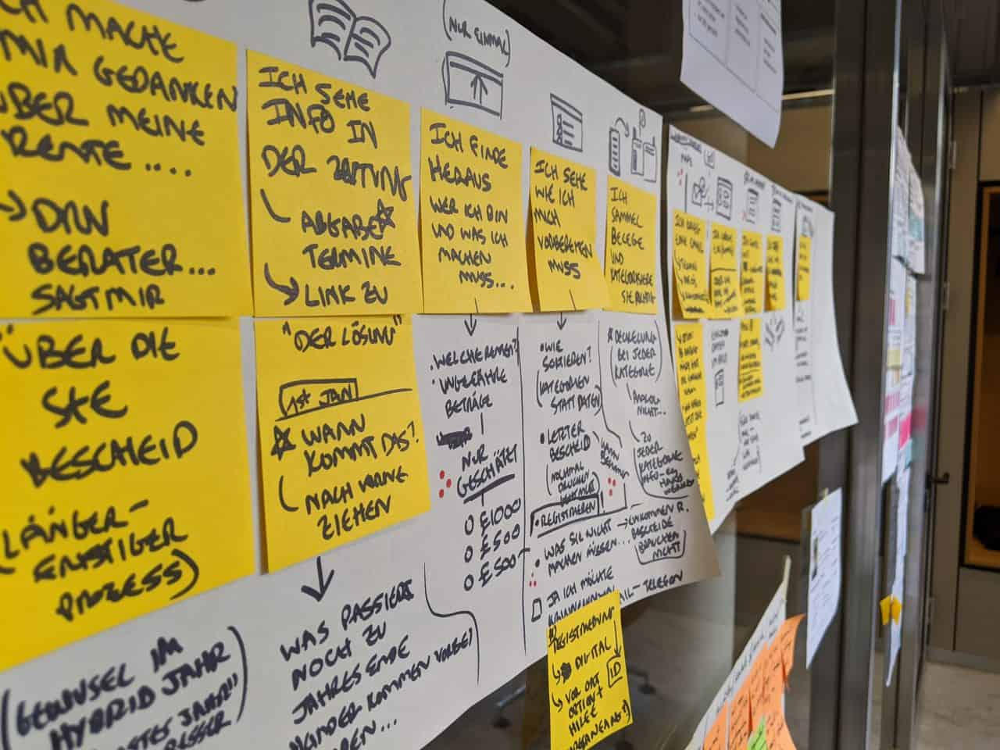
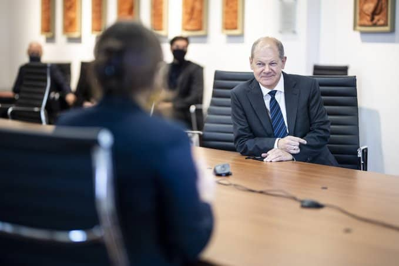
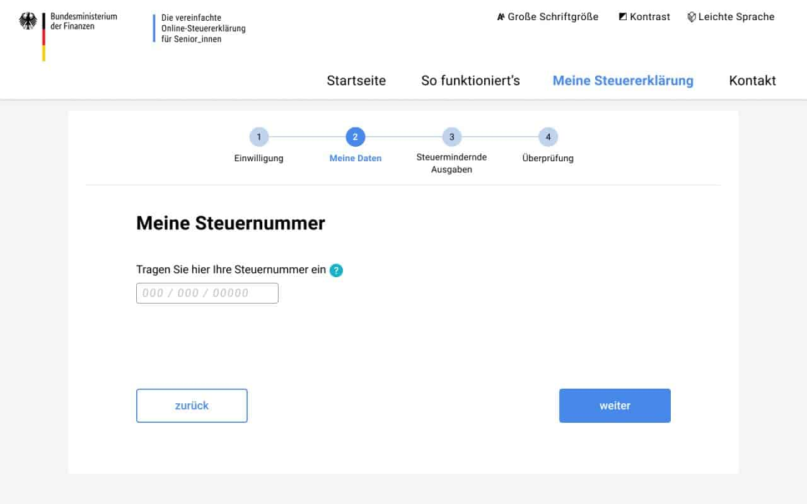
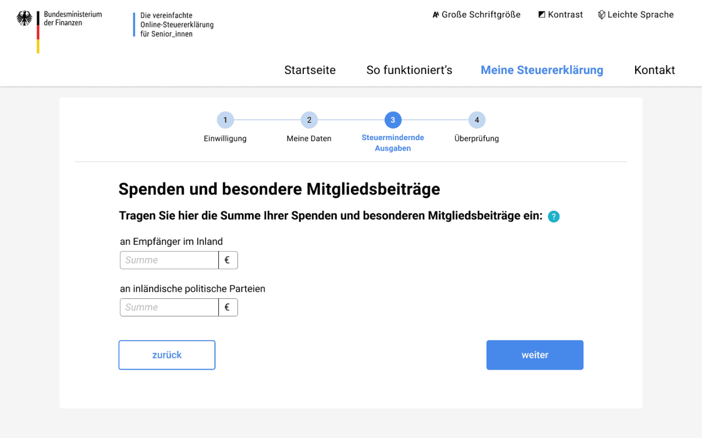
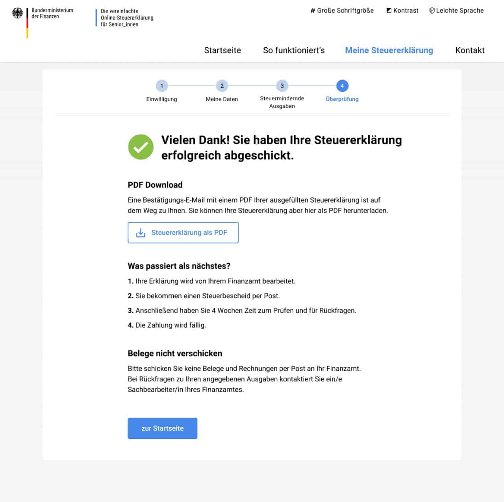

# Projekt Steuerlotse BMF 2020

# Steuerlotse

Gemeinsam mit dem BMF und MdFE entwickelter Prototyp für eine einfache, zukunftsfähige und digitale Steuererklärung für Rentner:innen. 

#### [Fallstudie (PDF)](https://tech.4germany.org/wp-content/uploads/2020/10/Fallstudie_Steuerlotse.pdf)

# +++ Steuerlotse seit 31. Mai live +++

Nach der Prototypisierung durch Tech4Germany wurde der [DigitalService4Germany](https://www.digitalservice4germany.org) mit der Umsetzung und Weiterentwicklung des Steuerlotsen beauftragt. Rentner:innen können ihre Steuererklärung jetzt mit dem Steuerlotsen einfach und unkompliziert abgeben. 

#### [Jetzt Steuererklärung machen](http://www.steuerlotse-rente.de) 

# Hintergrund & Herausforderung

Immer mehr Rentenempfänger:innen müssen eine Steuererklärung abgeben. Um diese Pflicht möglichst unkompliziert zu gestalten, erproben einige Bundesländer eine **neue zweiseitige Papiererklärung **für Steuerpflichtige mit Alterseinkünften. Da die Höhe der ausgezahlten Rente bereits elektronisch im Finanzamt vorliegt, brauchen die Bürger:innen nicht mehr ihre Renteneinkünfte angeben. Der vereinfachte Papiervordruck spart auch den Sachbearbeiter:innen im Finanzamt Zeit, ist aber noch nicht digital nutzbar. Deswegen sind Projektpartner:innen aus dem BMF und dem MdFE eine Kooperation mit dem Tech4Germany-Programm eingegangen, um gemeinsam zu erkunden, wie ein digitaler Onlinedienst nutzerfreundlich umgesetzt werden kann.

# Ressourcen

#### [GitHub (Code)](https://github.com/tech4germany/steuerlotse) 

#### [Fallstudie (PDF)](f1_Fallstudie_Steuerlotse.pdf)

#### [Dokumentation (PDF)](f2_Steuerlotse-Doku-Final-212020.pdf)

# LINKS

#### [Prototyp](https://steuerlotse.tech4germany.org/)

#### [Auf der BMF-Seite](https://www.bundesfinanzministerium.de/Content/DE/Standardartikel/Themen/Schlaglichter/Rentenbesteuerung/2020-10-16-steuerlotse.html)

# Zielsetzung & Vorgehen

Ziel des Projektes ist es den Rentner:innen die Erfüllung ihrer steuerlichen Pflichten zu erleichtern und sie zu entlasten. Zudem sollten sie dazu befähigt werden, ihre Erklärungen digital einzureichen, um eine spätere digitale Bearbeitung in den Ämtern zu ermöglichen. Als inhaltliche Herausforderungen konnten frühzeitig die Sprache, die Authentifizierung und die unterschiedlichen digitalen Fähigkeiten der Rentner:innen identifiziert werden.

Um zu verstehen, wie eine nutzerzentrierte digitale Lösung aussehen könnte, hat sich das Team intensiv mit den Bedürfnissen der Rentner:innen beschäftigt und zahlreiche Interviews geführt. Ergänzt wurde dies durch Gespräche mit Expert:innen und Sachbearbeiter:innen vor Ort im Finanzamt Potsdam. Aufbauend auf dieser initialen **Nutzerforschung** sind erste Lösungsansätze entwickelt und als Prototypen mit Rentner:innen getestet worden.

 \
Projektarbeit: Gemeinsame Workshops

 \
Ideen-Entwicklung

 \
Treffen mit Olaf Scholz \
© Bundesministerium der Finanzen/Photothek

# Erkentnisse & Lösung

In den Interviews zeigte sich schnell, dass die Steuererklärung ein sehr emotionales Thema ist: Viele Rentner:innen haben große **Ängste und Unsicherheiten, **die schon vor dem eigentlichen Ausfüllen des Formulars auftreten. Zudem gibt es zahlreiche Personen, die zwar über das nötige Basiswissen zu Steuern und auch über grundlegende digitale Fähigkeiten verfügen, sich aber dennoch nicht zutrauen eine digitale Steuererklärung selbst zu machen.

Deshalb haben wir uns entschieden, nicht nur ein nutzerfreundliches Formular zu entwickeln, sondern auch eine **eigene Website** zu konzipieren. Durch zielgruppengerechte Ansprache auf der Landingpage werden Ängste ab- und Vertrauen aufgebaut. So werden die richtigen Voraussetzungen geschaffen, um die Nutzer:innen in das neu gestaltete, vereinfachte Formular und somit auf den Pfad zur digitalen Steuererklärung zu führen.

## Schritt-für-Schritt

Das Formular selbst leitet Nutzer **Schritt-für-Schritt **durch den Prozess und beinhaltet nur die Angaben, die für die Zielgruppe relevant sind. 

## Klare Struktur

Es wird nach verständlichen, lebensnahen Kategorien strukturiert und bietet durch zusätzliche Erläuterungen optionale Hilfestellungen. Dadurch wird den Nutzer:innen ein Gefühl von **Vertrauen **und Sicherheit vermittelt.

## Sicher abschicken

Darüber hinaus zeigt der Prototyp, wie ein nutzerfreundlicher Prozess für ein sicheres Abschicken der Steuererklärungsdaten an Elster aussehen könnte.

# Unsere Ergebnisse sind frei verfügbar

## Dokumentation

Detailliertes Vorgehen und Ergebnisse des Projektteams

#### [Download](f2_Steuerlotse-Doku-Final-212020.pdf) 

## Prototyp

Funktionierender Prototyp unseres Steuerlotsen

#### [Jetzt ausprobieren](http://www.steuerlotse.tech4germany.org) 

## Code

Unsere Arbeitsergebnisse zum Wiederverwenden auf GitHub

#### [Link](https://github.com/tech4germany/steuerlotse) 

# das Team

 \
**Anna Meshcheryakova** \
Product Fellow

 \
**Julia Albrecht** \
Design Fellow

 \
**Lisa Kowalewski** \
Design Fellow

 \
**Daniel Hugenroth** \
Engineering Fellow

# Projektpartner

Bundesministerium der Finanzen

Land Brandenburg Ministerium der Finanzen und für Europa

 \
**Alfried Reusch** \
Projektleiter

 \
**Jördis Rüdiger** \
Digitallotsin
